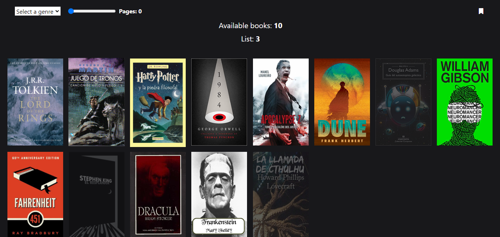
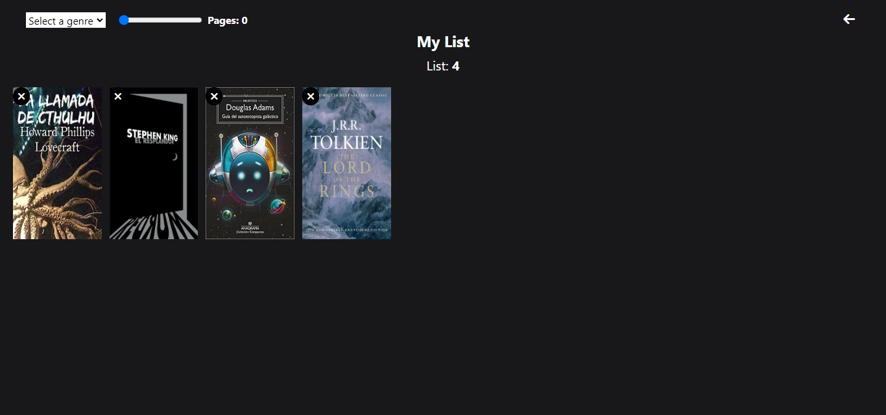

# PRUEBAS-TECNICAS-01 MIDUDEV 

Esta web fue realizada a partir del curso [**"pruebas-tecnicas"**](https://github.com/midudev/pruebas-tecnicas) de [**Midudev**](https://github.com/midudev).
Esta prueba consiste en crear una aplicación que pueda realizar las siguientes tareas:

 * _Listar los libros_
 * _Filtrar libros_
 * _Guardarlos en una lista de lectura_
 * _Sincronizar los datos_
 * _Persistencia de datos sin usar **Backend**_

### URL : https://preuba-tecnica-01.netlify.app/

&nbsp;

&nbsp;

### Instalación
##
 Instalar las dependencias:
 `$ npm install`

 Ejecutar en modo desarrollador:
 `$ npm run dev`

&nbsp;

### Construido con
##
 * JavaScript
 * [Vite](https://vitejs.dev/)
 * [TailwindCSS](https://tailwindcss.com/)

&nbsp;

### Contacto :mailbox:
##
 * :email: Email: valentinomonzonandres@gmail.com
 * :briefcase: LinkedIn: [Andrés Monzón](https://www.linkedin.com/in/andresvmonzon/)
 * :computer: GitHub: [Andymonzon](https://github.com/Andymonzon)
