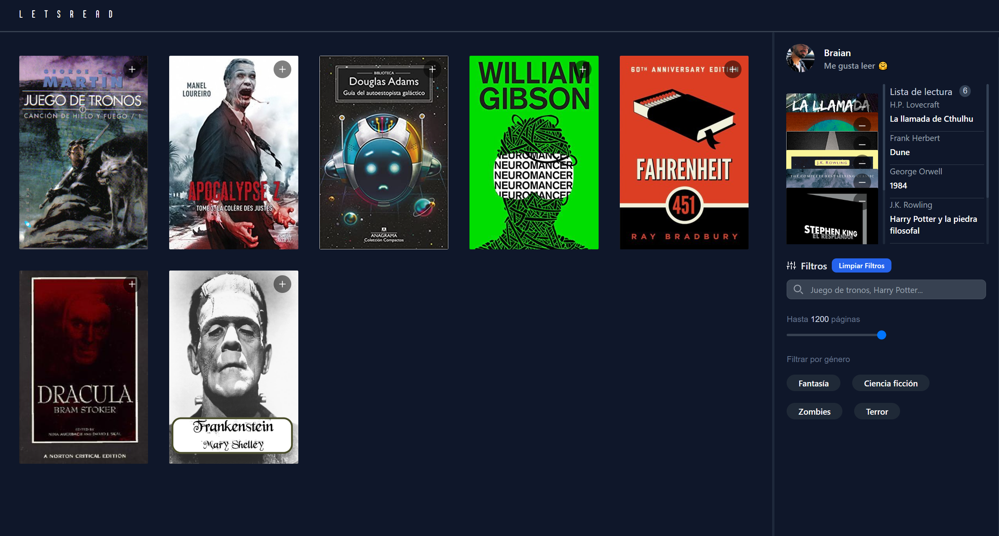

#  Lista de lectura (Prueba Tecnica Midudev)

### DESCRIPCIÓN

Implementar una pequeña aplicación web de lista de libros en la que podamos añadir y eliminar libros a la lista de lectura y filtrarlos por género, paginas y que se nos perma buscar a nuestra elección.

------------

#### Fucnionalidades

- Añadir y eliminar libros de la lista de lectura.
- Detalle con mas información del libro al seleccionarlo.
- Filtros por busqueda, por número de páginas y por génro.
- Entorno de almacenaje local de la información y persistencia entre pestañas.
------------

#### Tecnologias

- React
- Zustan
- Framer Motion
- tailwind
- vitest

