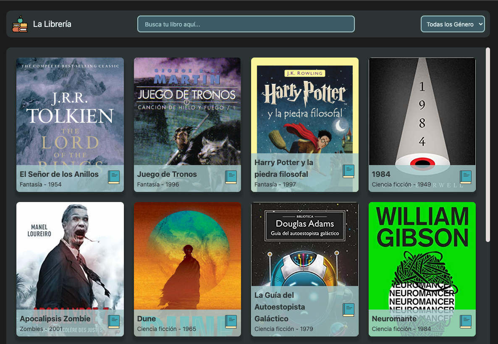

# 01 - Desarrollo de una Aplicación de Lista de Libros

El desarrollo consiste en crear una aplicación web que permita a los usuarios ver una lista de libro y pueden guardar un registro de los libros que desean leer en ese momento. 

URL Preview: https://cheery-blancmange-bbea77.netlify.app/

# Como levantar el proyecto 

  - pnpm install
  - pnpm run dev

  - pnpm run test (Ejecutar test)

