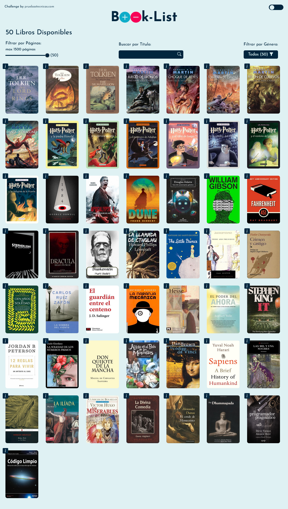

# Developing a Book List Application

This is a solution to the [Lista de Lectura challenge on Pruebas técnicas de Programación](https://github.com/midudev/pruebas-tecnicas/tree/main/pruebas/01-reading-list). "Pruebas técnicas de Programación" challenges help you to practice your programming skills with technical tests from real companies. Use the stack you prefer, submit your exercises, and receive feedback from the community. 

## Table of contents

- [Overview](#overview)
  - [The challenge](#the-challenge)
  - [Screenshot](#screenshot)
  - [Links](#links)
- [My process](#my-process)
  - [Built with](#built-with)
- [Author](#author)

## Overview

### The Challenge

We are a multinational book publishing company. We want to offer our audience a way to browse our catalog and create a reading list of books that interest them.

To achieve this, we want to develop a web application that allows users to view available books and create a reading list. Please note:

- We are not sure if the framework we are currently using will be the final one, but we aim to reuse as much code as possible.
- The application should be user-friendly and visually appealing.
- Approximately 80% of our users come from desktop browsers.

Use the `books.json` file to fetch book data. You can add more books if desired, as long as they follow the same structure.

#### Requirements

##### Functionality

1. **View Available Books**: The application should display a list of available books that users can browse.

2. **Create a Reading List**: Users should be able to create a reading list from the available books. The UI should clearly indicate which books are in the reading list and which ones are not. It should also be possible to move a book from the reading list back to the available list.

3. **Filter Books by Genre**: Users must be able to filter the list of available books by genre, and a counter showing the number of available books, books in the reading list, and available books in the selected genre should be displayed.

4. **State Synchronization**: There should be global state synchronization that reflects the number of books in the reading list and the number of books still available. If a book is moved from available to the reading list, both counts should be updated accordingly.

5. **Data Persistence**: The application should persist the reading list data in the browser's local storage. Upon page reload, the reading list should be retained.

6. **Cross-tab Synchronization**: If the user opens the application in two different tabs, changes made in one tab should be reflected in the other without the need for a backend.

7. **Deployment**: The application should be deployed on a free hosting service (Netlify, Vercel, Firebase, etc.) and accessible through a public URL. Indicate the URL in the README.

8. **Testing**: The application should have AT LEAST one test. Write the test you consider most important for your application.

##### Code Tips

1. **Code Structure**: The code should be well-organized and easy to read.

2. **HTML Semantics**: Use semantic and accessible HTML.

3. **Team Collaboration**: Prepare your project with the idea that any team member may need to work on it in the future (scripts in package.json, minimal documentation in README, comments in code if necessary, etc.).

4. **Code Formatting**: Ensure that your code is consistently formatted. You can use Prettier or any other formatting tool you prefer.

5. **Production-Ready**: Ensure your application is ready for production. Minimize code, optimize images, etc.

#### Additional Challenges

**Want to go above and beyond?** Here are some additional challenges you can try:

- Implement a search functionality for the list of available books.
- Add a new filter to filter books by the number of pages.
- Allow reordering of books in the reading list based on priority.
- Make your design responsive.

### Screenshot

### Links

- Solution URL: [GitHub](https://github.com/SFCC5555/pruebas-tecnicas/tree/main/pruebas/01-reading-list/SFCC5555)
- Live Site URL: [Book-List](https://sfcc-book-list.netlify.app/)

## My process

### Built with

- Vite
- Semantic HTML5 markup
- CSS custom properties
- Flexbox
- Mobile-first workflow
- Sass
- JavaScript
- Tailwind
- Bootstrap icons
- [React](https://reactjs.org/) - JS library
- Redux Toolkit
- React Router V6

## Author

- Website - [Fernando Carrasco](https://sfcc5555.netlify.app/)