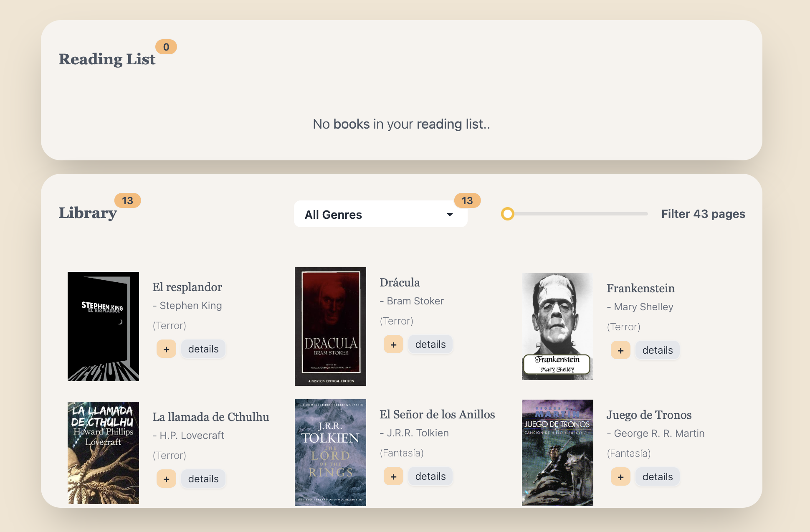
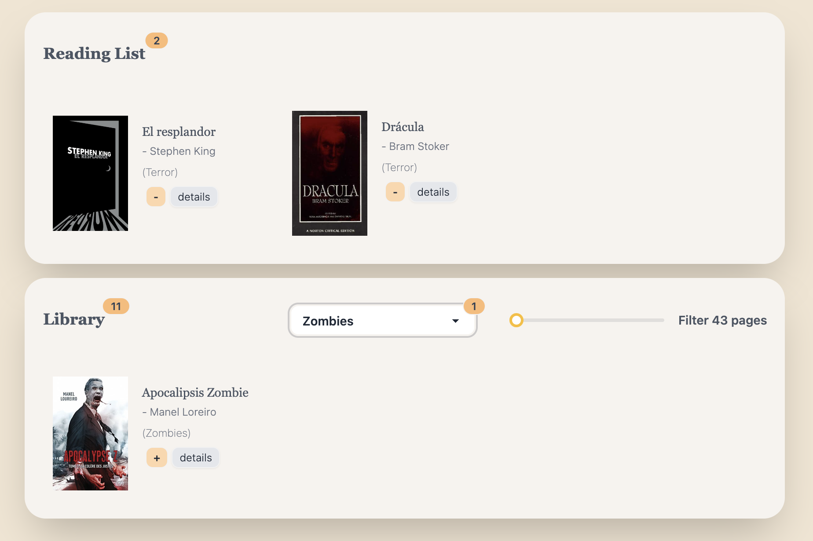
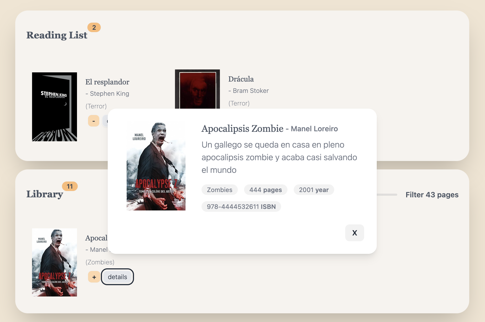

# Mi Aplicación de React

## Descripción

Somos un sello editorial de libros multinacional. Queremos ofrecer a nuestro público una forma de ver nuestro catálogo y poder guardar los libros que les interesan en una lista de lectura.

## Características

- Característica 1: Visualización de Libros Disponibles
- Característica 2: Creación de Lista de Lectura
- Característica 3: Filtrado de Libros por Género
- Característica 4: Sincronización de Estado
- Característica 5: Persistencia de Datos
- Característica 6: Sincronización entre pestañas
- Característica 7: Despliegue
- Característica 8: Test
- Característica 9: Añade un nuevo filtro para filtrar los libros por número de páginas (EXTRA)

## Capturas de Pantalla

A continuación, se muestran algunas capturas de pantalla de la aplicación:

## Instalación

1. Clona este repositorio en tu máquina local.
2. Abre una terminal y navega hasta el directorio del proyecto.
3. Ejecuta el comando `npm install` para instalar las dependencias.
4. Luego, ejecuta `npm start` para iniciar la aplicación.

## Contribución

Si quieres contribuir a este proyecto, sigue estos pasos:

1. Haz un fork de este repositorio.
2. Crea una rama con tu nueva funcionalidad: `git checkout -b nueva-funcionalidad`.
3. Realiza los cambios y realiza commit: `git commit -m "Agrega nueva funcionalidad"`.
4. Envía tus cambios al repositorio remoto: `git push origin nueva-funcionalidad`.
5. Abre un pull request para que revisemos tus cambios.

## Contacto

Si tienes alguna pregunta o sugerencia sobre la aplicación, no dudes en contactarme en mi correo electrónico: ggallianoms@gmail.com
