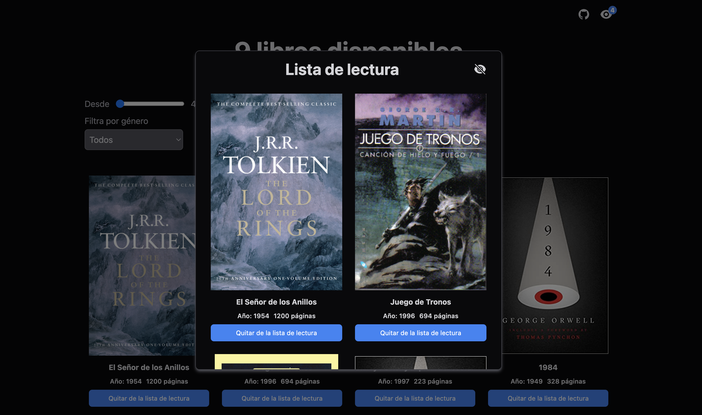

# [Technical Challenge 01 - Reading list](https://ivanatias-prueba01.netlify.app/)




## Run locally

```
// Clone the repository with all the technical challenges
git clone https://github.com/midudev/pruebas-tecnicas.git

// Navigate into the folder of this specific challenge
cd pruebas/01-reading-list/ivanatias

// Install dependencies
npm install

// Start the development server
npm run dev
```

## Run tests

```
npm run test

// To see coverage (this command will generate a `coverage` folder on `__tests__`)
npm run coverage
```
