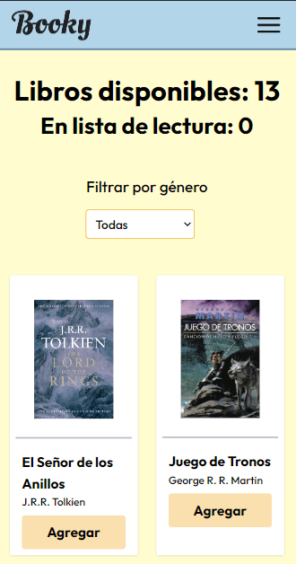

# booky-app

Prueba tecnica aplicacion web de libros con lista de lectura

## Funcionalidad

- [x] Visualización de Libros Disponibles: La aplicación debe mostrar una lista de libros disponibles que el usuario pueda revisar.

- [x] Creación de Lista de Lectura: El usuario debe ser capaz de crear una lista de lectura a partir de los libros disponibles. En la UI debe quedar claro qué libros están en la lista de lectura y cuáles no. También debe ser posible mover un libro de la lista de lectura a la lista de disponibles.

- [x] Filtrado de Libros por Género: Los usuarios deben poder filtrar la lista de libros disponibles por género, y se mostrará un contador con el número de libros disponibles, el número de libros en la lista de lectura y el número de libros disponibles en el género seleccionado.

- [x] Sincronización de Estado: Debe haber una sincronización del estado global que refleje el número de libros en la lista de lectura y el número de libros todavía disponibles. Si un libro se mueve de la lista de disponibles a la lista de lectura, el recuento de ambos debe actualizarse en consecuencia.

- [x] Persistencia de Datos: La aplicación debe persistir los datos de la lista de lectura en el almacenamiento local del navegador. Al recargar la página, la lista de lectura debe mantenerse.

- [x] Sincronización entre pestañas: Si el usuario abre la aplicación en dos pestañas diferentes, los cambios realizados en una pestaña deben reflejarse en la otra. Sin necesidad de usar Backend.

- [x] Despliegue: La aplicación debe estar desplegada en algún servicio de hosting gratuito (Netlify, Vercel, Firebase, etc) y debe ser accesible a través de una URL pública. Indica la URL en el README.

- [] Test: La aplicación debe tener AL MENOS un test. Haz el test que consideres más importante para tu aplicación.


## Instalación

```bash
$ pnpm install
```

```bash
$ pnpm run dev
```

## Pantallazos

#### Vista de celular



#### Vista de escritorio


## Links

- [Repo](https://github.com/JhonEduard26/booky-app)
- [Sitio](https://booky-app-react.netlify.app/)

## Tecnologias usadas

- [React](https://react.dev/)
- [TailwindCSS](https://tailwindcss.com/)
- [Zustand](https://github.com/pmndrs/zustand/blob/main/readme.md)
- [Wouter](https://github.com/molefrog/wouter#readme)
- [React Hot Toast](https://react-hot-toast.com/)


## Autor

- GitHub - [JhonEduard26](https://www.github.com/JhonEduard26)

- LinkedIn - [JhonEduard26](https://www.linkedin.com/in/jhon-eduard-bocanegra-ortiz/)
