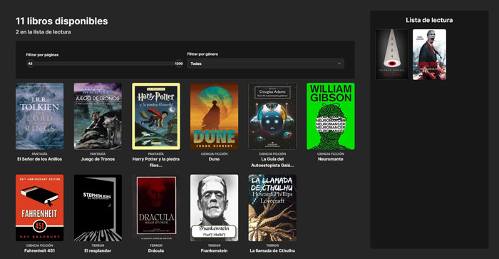

<div align="center">
  <h3 align="center">Reading List</h3>
  <p align="center">
     An app for users to keep see all books that are available and create a list of books they are currently reading.
    <br />
    <br />
    <a href="https://jlreadinglist.netlify.app/">View</a>
    ·
    <a href="https://github.com/joselupianez/pruebas-tecnicas/issues">Report Bug</a>
    ·
    <a href="https://github.com/joselupianez/pruebas-tecnicas/pulls">Request Feature</a>
  </p>
  
</div>

## How It's Made:
Reading List is a web application built using React, TailwindCSS, and Vitest for testing. The reading list is stored on the browser's local storage.

## Tech Used:
[![JS][Javascript]][Javascript]
[![NodeJS][Node.JS]][Node.JS]
[![TailwindCSS][Tailwind.CSS]][Tailwind.CSS]
[![React][React]][React]


## Installation

```sh
pnpm install
```

### Run
Start the development server
```sh
pnpm run dev
```

### Run
Start the development server
```sh
pnpm run dev
```

<!-- MARKDOWN LINKS & IMAGES -->
[Javascript]: https://img.shields.io/badge/javascript%20-%23323330.svg?&style=for-the-badge&logo=javascript&logoColor=%23F7DF1E
[Node.JS]: https://img.shields.io/badge/Node.js-43853D?style=for-the-badge&logo=node.js&logoColor=white
[Tailwind.CSS]: https://img.shields.io/badge/Tailwind_CSS-38B2AC?style=for-the-badge&logo=tailwind-css&logoColor=white
[React]: https://img.shields.io/badge/React-20232A?style=for-the-badge&logo=react&logoColor=61DAFB
