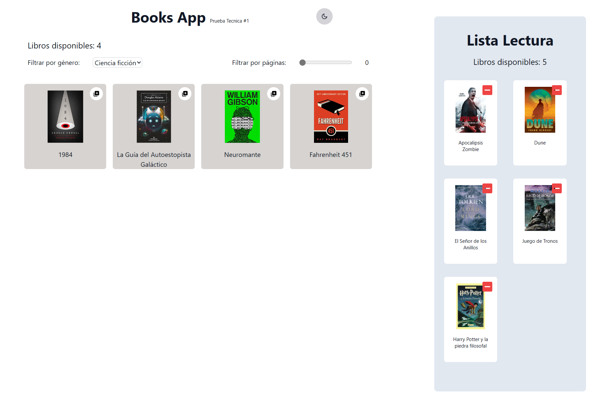

# Books App - Prueba Tecnica #1 

Books App es una aplicación para gestionar una lista de lectura personal. Los usuarios pueden buscar libros por género o número mínimo de páginas y agregarlos a su lista de lectura.

[Books App](https://book-app-pt.netlify.app/)

## Instalación

Para instalar y configurar Books App en un entorno local, sigue estos pasos:

1. Clona el repositorio en tu máquina local.
2. Ejecuta `npm install` para instalar las dependencias del proyecto.
3. Ejecuta `npm start` para iniciar la aplicación en modo desarrollo.

## Uso

Para usar Books App, sigue estos pasos:

1. Abre la aplicación en tu navegador.
2. Usa los filtros para buscar libros por género o número mínimo de páginas.
3. Haz clic en el botón "Agregar a la lista de lectura" para agregar un libro a tu lista de lectura.

## Tecnologías utilizadas

Books App está construida con las siguientes tecnologías:

- React
- Vite
- Tailwind CSS

## Contribución

Si deseas contribuir a Books App, sigue estos pasos:

1. Haz fork del repositorio y clónalo en tu máquina local.
2. Crea una nueva rama para tus cambios.
3. Haz tus cambios y envía un pull request.

## Licencia

Books App se distribuye bajo la licencia MIT.
