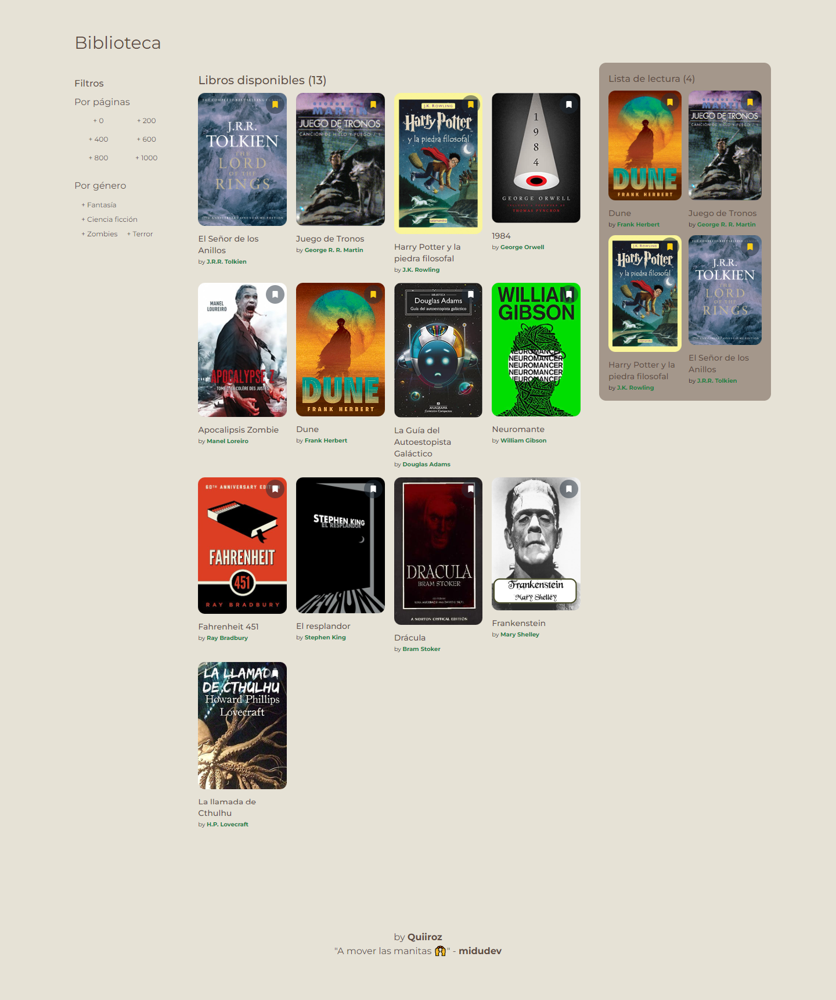

# Solución prueba tecnica midudev

## Reading List

Esta solución está hecha en React, utilizando Zustand para mantener un estado global

Se puede filtrar por número de páginas y por género.

Los libros que se añaden en la lista de lectura se mantienen en el número total de libros mostrados, con la diferencia de que hay un icono que indica cuales libros ya han sido agregados a esta lista basta con hacer clic en este icono para quitarlo de la lista.

Los libros a leer se guardan en localStorage.

Hay sincronización entre pestañas.

### Tecnologías utilizadas

[React](https://react.dev/)

[Vite](https://vitejs.dev/)

[Tailwind CSS](https://tailwindcss.com/)

[Zustand](https://zustand-demo.pmnd.rs/)

[Jest](https://jestjs.io/)

### Comandos para ejecutar el proyecto

`git clone`

`npm install`

`npm run dev`

`npm test`
