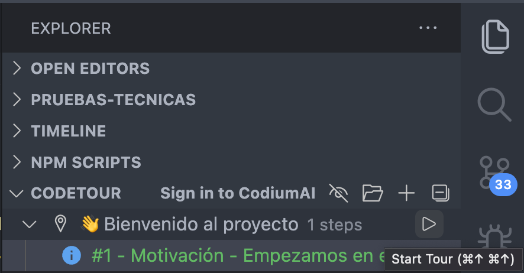
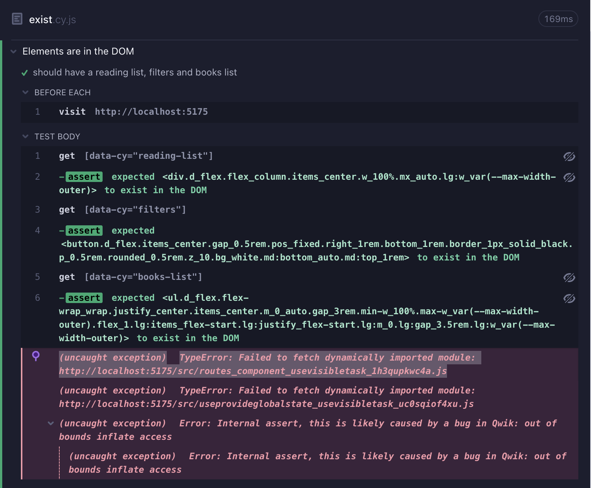

# Prueba Técnica - La lista de lectura

Aplicación útil realizada con Qwik y PandaCSS para gestionar tus próximas lecturas

Deploy [aquí](https://pruebas-tecnicas-lista-lectura-manuelsanchez2-59ggnem6y.vercel.app/)

## 🚀 Motivación

Un cliente nos has pedido que hagamos un sistema de gestión de libros de lectura con una serie de condiciones que detallaremos más adelante. Es importante que hagamos un código fácil de transformar, ya que no sabemos si vamos a continuar con este **tech stack** en el futuro.

La fecha de entrega es **el 27/07/2023** y tenemos presupuesto para trabajar estas dos semanas únicamente en este proyecto.

Por el momento este es el stack que utilizamos:

- [Qwik](https://qwik.builder.io/) como framework (utiliza vite como bundler).
- [PandaCSS](https://panda-css.com/) como librería de utility classes para CSS.
- [Vitest](https://vitest.dev/) como unit test library.
- [Node version 18](https://nodejs.org/en). Si eres usuario de nvm, simplemente haz nvm use antes de instalar dependencias.

Si tienes alguna duda sobre Qwik como framework, puedes consultar [esta maravillosa guía en español](https://www.manuelsanchezweb.com/cursos/qwik/).

## 🎯 Objetivos

Podríamos dividir los objetivos en dos tipos: must y nice-to-have.

### Must

- [x] Creación de la vista general de libros disponibles
- [x] Creación de la vista general de lista de lectura
- [x] Añadir la posibilidad de filtrar los libros disponibles por género
- [x] Sincronización de estado (tanto de libros disponibles como de lista de lectura)
- [x] Persistencia de datos (local storage)
- [x] Sincronización entre pestañas
- [x] Despliegue en Vercel
- [x] Test (en este caso unit test o end to end)

### Nice-to-have

- [x] Añadir la posibilidad de filtrar los libros disponibles por número de páginas
- [x] Añadir un sistema de búsqueda de libros (apuntar useDebounce)
- [x] Añadir una reorganización por prioridad en la lista de lectura
- [x] Posibilidad de descargar la lista de lectura en el almacenamiento local del navegador
- [x] Responsiveness (aunque la mayoría de usuarios vengan de escritorio)

## 👨‍🦯 CodeTour

Hemos creado unos code tours en el repositorio. Para poder acceder a ellos, simplemente tienes que tener la extensión [CodeTour](https://marketplace.visualstudio.com/items?itemName=vsls-contrib.codetour) en tu IDE y luego darle al botón de play tal y como indica la siguiente imagen.

## ✉️ Contacto

En caso de dudas, siempre puedes escribir al [Team Lead](mailto:manusansan22@gmail.com) del proyecto.

## 🧪 Test

Estamos trabajando duro para crear tests e2e en el proyecto. Al intentar crear algo avanzado, nos topamos con la siguiente información, que parece ser un error de Qwik y no de Cypress. ¡Nos hemos puesto en contacto con ellos para ver si lo podemos arreglar!

