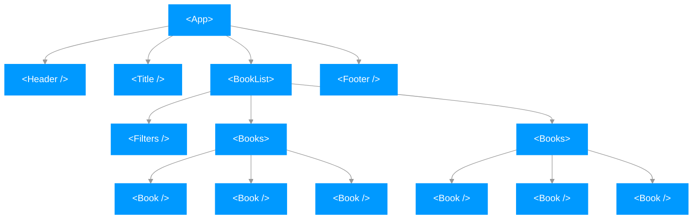

# Midureads - solución para la prueba técnica [01-reading-list](https://github.com/midudev/pruebas-tecnicas/tree/main/pruebas/01-reading-list)

Este proyecto, denominado "Midureads", es una propuesta de solución para la prueba técnica [01-reading-list](https://github.com/midudev/pruebas-tecnicas/tree/main/pruebas/01-reading-list) del proyecto [Pruebas técnicas de Programación](https://pruebastecnicas.com/) de [midudev](https://github.com/midudev).

## Requisitos completados
- ✅ Visualización de libros disponibles
- ✅ Creación de lista de lectura
- ✅ Filtrado de libros por género
- ✅ Sincronización de estado
- ✅ Persistencia de datos
- ✅ Sincronización entre pestañas
- ✅ Despliegue
- ✅ Test
- ✅ Búsqueda de libros y autores
- ✅ Filtrado de libros por número de páginas
- ✅ Reorganización de los libros en la lista de lectura
- ✅ Diseño responsive

## Tecnologías, frameworks y librerías utilizadas

La aplicación ha sido construida utilizando las siguientes tecnologías, frameworks y librerías:

- [Vite](https://vitejs.dev/): herramienta de compilación que tiene como objetivo proporcionar una experiencia de desarrollo más rápida y ágil para proyectos web modernos.
- [React](https://es.react.dev/): biblioteca de JavaScript para construir interfaces de usuario interactivas y reutilizables.
- [Tailwind](https://tailwindcss.com/): framework CSS que facilita la aplicación de estilos de una manera ágil y optimizada.
- [Tremor](https://www.tremor.so/): librería de componentes de React.
- [React beautiful dnd](https://github.com/atlassian/react-beautiful-dnd): biblioteca que facilita la creación de listas arrastrables y reordenables en aplicaciones React.
- [Playwright](https://playwright.dev/): librería que permite automatizar y realizar pruebas end-to-end en navegadores web.

## Estructura de la aplicación

A continuación, se muestra gráficamente la estructura de la aplicación, concretamente los componentes de la aplicación



## Iniciar el proyecto

Para iniciar el proyecto y levantar el servidor de desarrollo que ofrece Vite, sigue los siguientes pasos:

**1. Requisitos previos**

Asegúrate de tener instalado Node.js en tu sistema. Puedes descargar la última versión de Node.js desde el sitio [web oficial](https://nodejs.org/).

**2. Pasos para la instalación**

Abre una terminal o línea de comandos en el directorio raíz del proyecto, donde se encuentra el archivo package.json. Ejecuta el siguiente comando para instalar todas las dependencias necesarias:

```
npm install
```

Este comando leerá las dependencias definidas en el archivo package.json y descargará e instalará todas las bibliotecas y paquetes necesarios.

**3. Pasos para ejecutar el servidor de desarrollo**

Una vez que todas las dependencias se hayan instalado correctamente, puedes iniciar el servidor de desarrollo usando el siguiente comando:

```
npm run dev
```

El comando npm run dev ejecutará el script definido en el archivo package.json que inicia el servidor de desarrollo de Vite. Este servidor proporciona una experiencia de desarrollo rápida y ágil, y te permitirá ver los cambios en tiempo real mientras trabajas en la aplicación.

Después de ejecutar el comando, podrás acceder a la aplicación en tu navegador visitando la dirección http://localhost:5173 (o la dirección que se muestre en la terminal si el puerto 5173 está ocupado).
