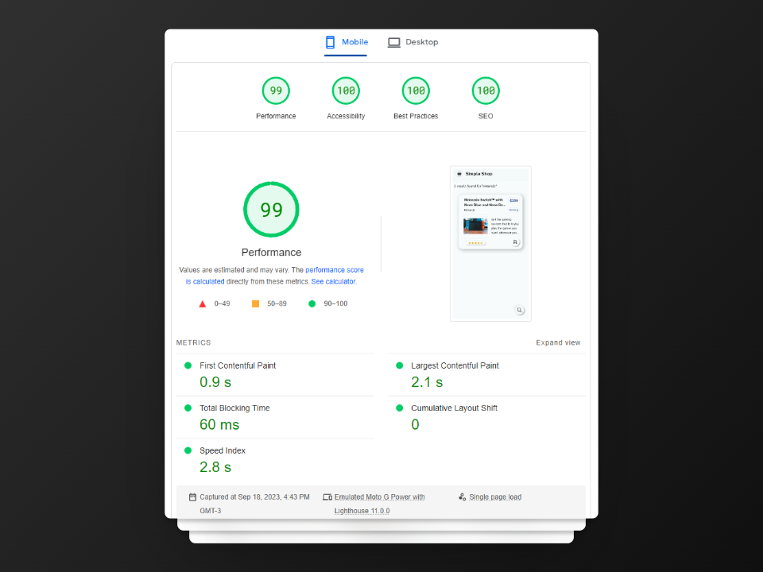
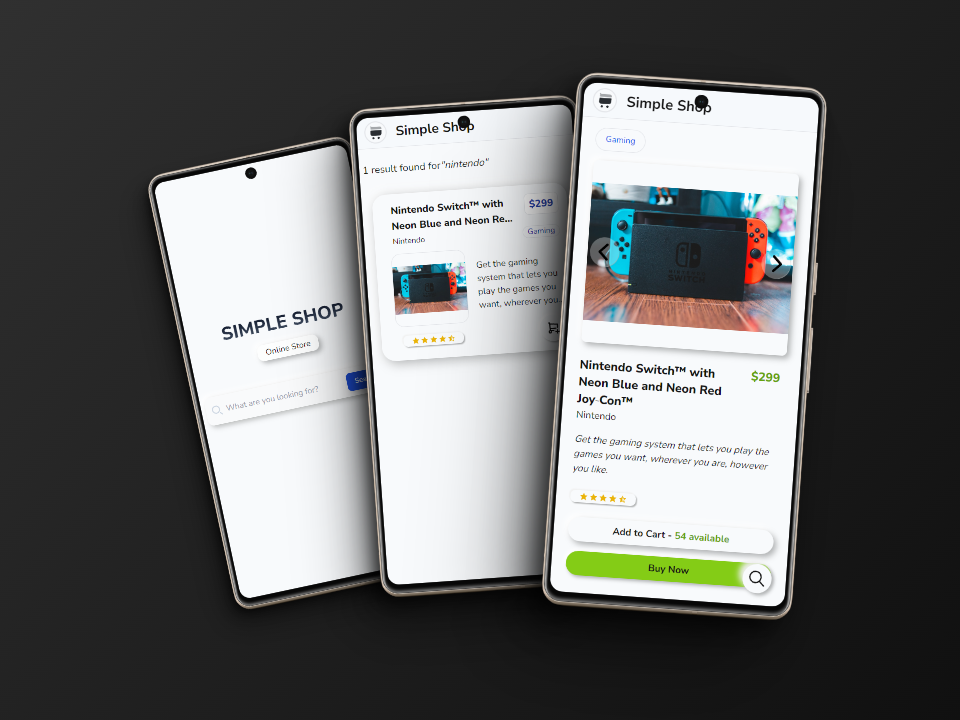

# Simple Shop

**Welcome! 👋**

This is a **Next JS** web application that simulates an e-commerce find-and-buy experience.  

I made it to practice my Web Developer skills and to gain proficiency in the used technologies 

\* *This is an original project. I'm not following any tutorial or predefined design system.*

## Performance

## Clean Code. Solid Architecture
✔ No ESLint warnings or errors  
✔ Maintainable and Scalable project and components architecture

## Views

**IMPORTANT: The site is optimized for mobile device screens**  
 

Built with

   

- [React](https://reactjs.org/)
- [Next.JS 13](https://nextjs.org/docs/app) - Using the brand new App Router paradigm
- [Typescript](https://www.typescriptlang.org/)
- [Tailwind CSS](https://tailwindcss.com/)
- [React Hook Form](https://react-hook-form.com/)
- [Auto Animate](https://auto-animate.formkit.com/) - For subtle animations
- [Vercel](https://vercel.com/)  
 

Development roadmap

 

&nbsp;&nbsp; &#9745; Prepare environment  
&nbsp;&nbsp; &#9745; Create and clean-up Next.JS project  
&nbsp;&nbsp; &#9745; Configure main layout (Fonts, Metadata for SEO)  
&nbsp;&nbsp; &#9745; Create pages using App router paradigm  
&nbsp;&nbsp; &#9745; Create landing page with search bar  
&nbsp;&nbsp; &#9745; Handle search functionality with React Hook Forms  
&nbsp;&nbsp; &#9745; Create results page  
&nbsp;&nbsp; &#9745; Create product page  
&nbsp;&nbsp; &#9745; Add neumorphism style. Using Tailwind CSS  
&nbsp;&nbsp; &#9745; Add simple transitions to improve UI  
&nbsp;&nbsp; &#9745; Create endpoints for products searching using route.ts inside API route  
&nbsp;&nbsp; &#9745; Check accessibility (aria labels, contrast issues)  
&nbsp;&nbsp; &#9745; Optimize for performance (es, fonts preloading)  
&nbsp;&nbsp; &#9745; Check and fix linter suggestions  
&nbsp;&nbsp; &#9745; Deploy on Vercel  
&nbsp;&nbsp; &#9745; Create Readme  
 

ToDos

 

&nbsp;&nbsp; &#9744; Add end-to-end testing  
&nbsp;&nbsp; &#9744; Add media queries  
&nbsp;&nbsp; &#9744; Add skeletons on loading  
&nbsp;&nbsp; &#9744; Improve error handling and error displaying  
&nbsp;&nbsp; &#9744; Add more products to the database  
&nbsp;&nbsp; &#9744; Dark/Light Mode  
 

Live Demo

 

Check out and test the live demo of the application: [Simple Shop](https://simple-shop-nine.vercel.app/)

** Please, feel free to reach out to me if you have any suggestions **

 

Want to run it locally?

 
Follow these steps:

1. Clone the repository.
   - `git clone https://github.com/fernandochaza/pruebas-tecnicas.git`  

2. Access the project folder.
   - The project files are in a subdirectory. You will need to access it before installing the dependencies.
   - The directory is: `02-bazar-universal/fernandochaza/simple-shop` 

3. Install dependencies.

   - Once you're in 'simple-shop' directory, run: 
     - `npm install`

4. Start the development server with: 
   - `npm run dev`

## Let's talk!

* Email: fernandochaza@gmail.com
* Phone: +5492974607698
* Whatsapp: [Click to chat](https://wa.me/5492974607698) 
* Discord: [Contact on Discord](https://discord.com/users/413889897909321729)
* LinkedIn : [See my LinkedIn profile](https://www.linkedin.com/in/fernandochazarreta/)
