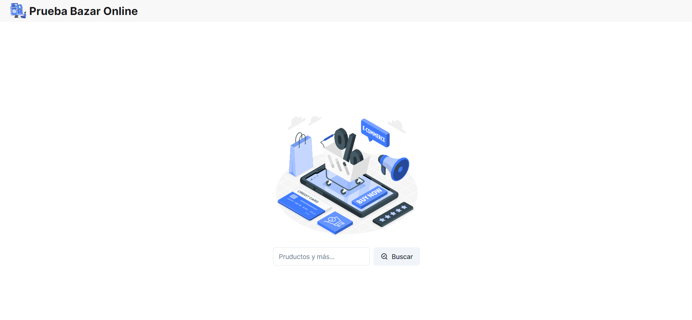
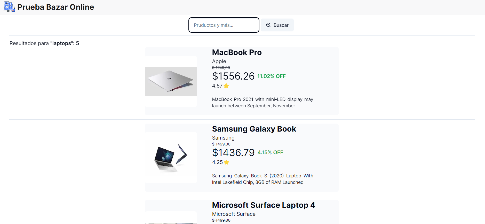

# Bazar Online - Prueba Tecnica #2 

## Descripción
Bazar Online es una aplicación web que permite buscar productos similar a Mercado Libre.

[Bazar Online](#TODO Agregar link a la app)

## Instalación

Para instalar y configurar Bazar Online en un entorno local, sigue estos pasos:

1. Clona el repositorio en tu máquina local.
2. Ejecuta `npm install` para instalar las dependencias del proyecto.
3. Ejecuta `npm run dev` para iniciar la aplicación en modo desarrollo.

## Uso

Para usar Bazar Online, sigue estos pasos:

1. Abre la aplicación en tu navegador.
2. Usa el buscador para encontrar los productos.
3. Haz clic en el producto para ver más detalles.

## Tecnologías utilizadas

Bazar Online está construida con las siguientes tecnologías:

- Nextjs13
- Tailwind CSS

## Pruebas

Para ejecutar las pruebas, sigue estos pasos:
- Usa el script `npm run cypress:open` para ejecutar las pruebas.

## Contribución

Si deseas contribuir a Bazar Online, sigue estos pasos:

1. Haz fork del repositorio y clónalo en tu máquina local.
2. Crea una nueva rama para tus cambios.
3. Haz tus cambios y envía un pull request.

## Licencia

Bazar Online se distribuye bajo la licencia MIT.
